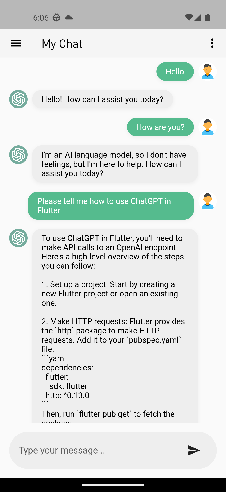
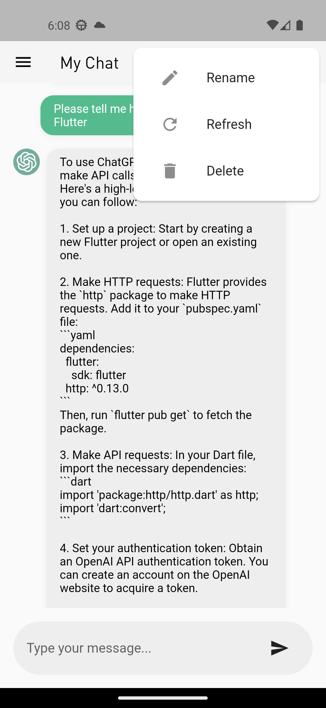
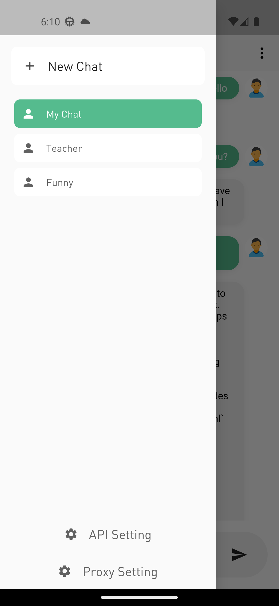

# Simple ChatGPT Flutter Version

This is a simple version of **ChatGPT in Flutter**, using your own API key. With this app, you can chat in app with ChatGPT. I never learned flutter before, but with ChatGPT, I created this simple version in 2 days! You can build this too!

I implemented this for fun and improving my code skills, also other flutter beginners can start with my projects to build their ideas. There may be some bugs though, bare with me. But the data structure classes are delicately written! I've learned a lot during this simple development, the biggest lesson is:

**Think before you code!**

|  |  |  |
| - | - | - |
|  |  |  |

## Getting Started
### Prerequisites
Before you start, make sure you have the following:

Flutter installed on your machine. You can follow the instructions here.
An API key for the OpenAI ChatGPT language model. You can apply for an API key here.
### Installation
Clone the repository to your local machine.
Run the app on your device or emulator using flutter run.
You will also need the Xcode to simulate the ios environment.

'''
flutter run
'''

## Features
The app includes the following features:

- Chat with ChatGPT using the OpenAI API
- Display chat history
- Add new conversations
- Rename existing conversations
- Delete conversations

## Acknowledgments
The OpenAI API for providing the language model used in the app.
The Flutter framework for making it easy to build beautiful and fast mobile apps.

## License
MIT License
